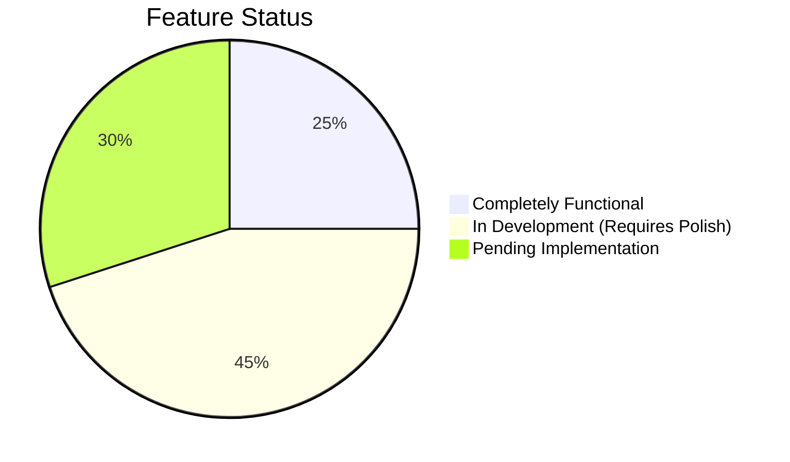
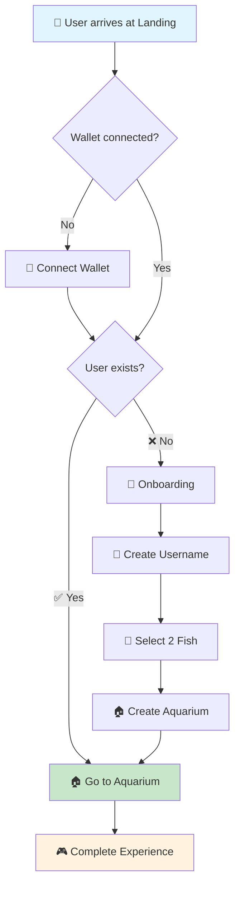
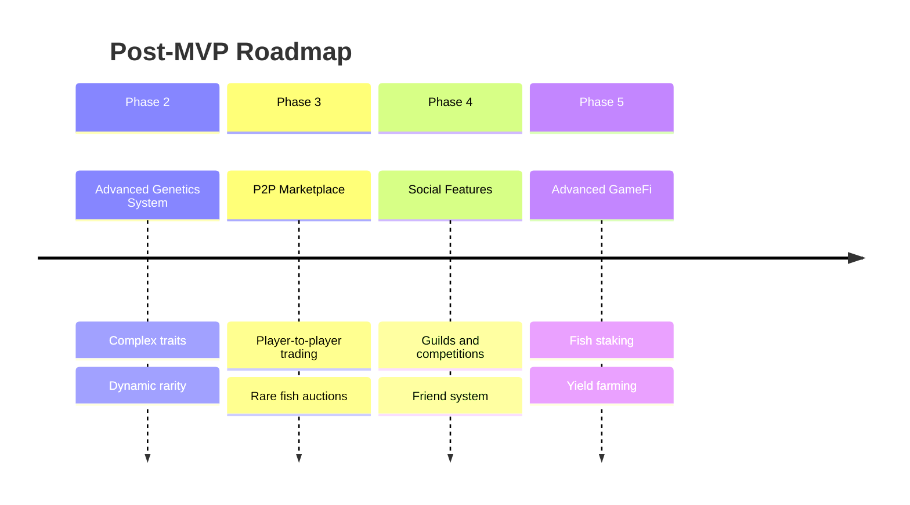

# 🐠 AquaStark MVP Documentation - End of Month Target

<div align="center">


**Virtual Aquarium Game on Starknet**

---

</div>

## 🎯 Final MVP Vision

By the end of the month, **AquaStark** will be a **completely functional** virtual aquarium game where users can:

| Feature | Expected Status |
|:---|:---|
| 🔐 Authentication | **100% Functional** - No connection bugs |
| 🏠 Aquarium Management | **Completely Operational** - All interactions work |
| 🐠 Breeding System | **Fully Functional** - No breeding errors |
| 💰 Game Economy | **Bug-Free** - Successful Starknet transactions |
| 🎮 User Experience | **Polished and Stable** - Tutorial and settings without bugs |

> **⚠️ CRITICAL CRITERION**: It's not enough for pages to exist - **ALL functionalities must be completely operational, bug-free, and provide a smooth user experience**.

## 📊 Current Development Status

<div align="center">



</div>

### ✅ Base Features Implemented

<table>
<tr>
<td width="50%">

**🔐 Authentication System**
- ✅ Landing page with wallet button
- ✅ Starknet network verification  
- ✅ New user onboarding
- ✅ Automatic redirection

</td>
<td width="50%">

**📄 Base Pages**
- ✅ Credits page
- ✅ Navigation structure
- ✅ Starknet integration

</td>
</tr>
</table>

### 🔄 In Development - **REQUIRES COMPLETE FUNCTIONALITY**

> **🎯 Objective**: These features are partially implemented but **must be 100% operational** without bugs for the final MVP.

<table>
<tr>
<td width="33%">

**🛒 Store System**
- 🔄 Product UI *(improve)*
- 🔄 Coin purchases
- 🔄 STRK transactions

</td>
<td width="33%">

**🧬 Breeding System**
- 🔄 Fish selection
- 🔄 Waiting time
- 🔄 Offspring generation

</td>
<td width="33%">

**⚙️ Support Pages**
- 🔄 Interactive tutorial
- 🔄 Settings
- 🔄 Multiple languages

</td>
</tr>
</table>

### ❌ Critical Features Pending

<div align="center">

**⚠️ THESE FEATURES MUST BE COMPLETELY OPERATIONAL FOR MVP**

</div>

**🐠 Aquarium Features (HIGH PRIORITY)**

```
┌─────────────────────────────────────────┐
│  🏠 INTERACTIVE AQUARIUM                │
├─────────────────────────────────────────┤
│ • Fish feeding FUNCTIONAL               │
│ • Health and happiness VISIBLE         │
│ • Cleaning OPERATIONAL                  │
│ • Decorations PLACEABLE                 │
│ • Parameters REAL-TIME                  │
└─────────────────────────────────────────┘
```

**🔬 Advanced Systems (COMPLETE FUNCTIONALITY REQUIRED)**

| System | Requirement |
|:---|:---|
| 🌳 Family tree | **Complete and navigable visualization** |
| 🧬 Genetics system | **Precise calculations without errors** |
| 🏆 Achievements | **Triggers working correctly** |
| 👤 User profile | **Real-time data from blockchain** |

**💎 Purchase Features (ERROR-FREE TRANSACTIONS)**

- Fish purchases → **Must execute without errors**
- Decoration purchases → **Inventory updated correctly**
- Coin system → **Accurate and synchronized balance**

## 🚀 End of Month Objectives

<div align="center">

**🎯 COMPLETE FUNCTIONALITY - NOT JUST PAGES THAT EXIST**


</div>

### 🔥 Critical Features - **MUST WORK PERFECTLY**

<table>
<tr>
<td width="50%">

**1. 🏠 100% Operational Aquarium System**

```
✅ Feeding → Fish react
✅ Indicators → Update live  
✅ Cleaning → Visual effects
✅ Decorations → Functional drag & drop
```

**2. 🧬 Error-Free Breeding**

```
✅ Selection → Intuitive UI
✅ Wait time → Real countdown
✅ Generation → Successful transaction
✅ New fish → Appears in aquarium
```

</td>
<td width="50%">

**3. 💰 Functional Economy**

```
✅ STRK purchase → Coins updated
✅ Balance → Real-time sync
✅ Transactions → No failures
✅ Inventory → Immediate updates
```

**4. 🎮 Polished Experience**

```
✅ Tutorial → Completely guided
✅ Settings → All operational
✅ Profile → Updated data
✅ Navigation → Bug-free
```

</td>
</tr>
</table>

### 📋 MVP Quality Checklist

<div align="center">

**❌ IT'S NOT ENOUGH FOR THE PAGE TO EXIST**  
**✅ IT MUST FUNCTION COMPLETELY**

</div>

| Area | Acceptance Criteria |
|:---|:---|
| 🔐 **Authentication** | ✅ 100% reliable wallet connection |
| 🏠 **Aquarium** | ✅ All interactions respond |
| 🛒 **Store** | ✅ Purchases process without errors |
| 🧬 **Breeding** | ✅ Complete process from start to finish |
| ⚙️ **Settings** | ✅ Each setting works correctly |
| 📱 **UI/UX** | ✅ Responsive and visually bug-free |
| ⛓️ **Blockchain** | ✅ All transactions successful |

### 🚧 "Coming Soon" Status Pages

<div align="center">


</div>

The following features will show **"Coming Soon"** pages in the MVP to keep scope focused:

- 🔬 Advanced genetics system
- 🧪 Advanced breeding laboratory  
- 🏆 Complete achievements system
- 📚 Detailed discovered species
- 📊 Advanced transaction analysis

---

## 🌊 Expected User Flow

<div align="center">



</div>

### 🆕 New User Experience

<table>
<tr>
<td width="10%">

**1.**

</td>
<td width="90%">

**Landing Page** → Connects Starknet wallet *(must work without errors)*

</td>
</tr>
<tr>
<td>

**2.**

</td>
<td>

**Detection** → System verifies if new user *(blockchain validation)*

</td>
</tr>
<tr>
<td>

**3.**

</td>
<td>

**Onboarding** → Creates username + selects 2 fish *(completely functional UI)*

</td>
</tr>
<tr>
<td>

**4.**

</td>
<td>

**First Aquarium** → Receives aquarium with fish *(correct visualization)*

</td>
</tr>
<tr>
<td>

**5.**

</td>
<td>

**Exploration** → Can feed, clean, decorate *(all functions operational)*

</td>
</tr>
</table>

### 🔄 Existing User Experience

<table>
<tr>
<td width="10%">

**1.**

</td>
<td width="90%">

**Login** → Connects wallet *(automatic recognition)*

</td>
</tr>
<tr>
<td>

**2.**

</td>
<td>

**Redirection** → Goes straight to aquarium *(loads data correctly)*

</td>
</tr>
<tr>
<td>

**3.**

</td>
<td>

**Management** → Interacts with existing fish *(no loading bugs)*

</td>
</tr>
<tr>
<td>

**4.**

</td>
<td>

**Features** → Access to breeding, store, etc. *(smooth navigation)*

</td>
</tr>
</table>

---

## ✅ MVP Success Criteria

<div align="center">

**🎯 DEFINITION OF "FUNCTIONAL" = BUG-FREE + COMPLETE EXPERIENCE**

</div>

| Area | Success Criteria | Quality Level |
|:---|:---|:---|
| 🔐 **Authentication** | 100% reliable wallet connection |  |
| 🏠 **Aquarium Management** | Feeding, cleaning, decoration without failures |  |
| 🧬 **Breeding** | Successful reproduction from start to finish |  |
| 💰 **Economy** | Purchases and balance without errors |  |
| 🎮 **UX** | Tutorial and settings 100% operational |  |
| ⛓️ **Blockchain** | All transactions registered correctly |  |

### 🔍 Quality Indicators

- **✅ Complete Functionality**: No placeholders or "half-done" functions
- **✅ No Critical Bugs**: All interactions respond correctly  
- **✅ Smooth Experience**: Intuitive navigation without UI errors
- **✅ Stable Blockchain**: Successful transactions on Starknet
- **✅ Optimal Performance**: Acceptable loading times

---

## ⚙️ Technical Considerations

<div align="center">

**🏗️ ARCHITECTURE FOR COMPLETE FUNCTIONALITY**

</div>

### 🔧 Technology Stack

| Component | Technology | Requirement |
|:---|:---|:---|
| ⛓️ **Blockchain** | Starknet | Error-free transactions |
| 💾 **Database** | *[To be defined]* | Reliable temporary states |
| 🎨 **Frontend** | *[Current framework]* | Responsive + optimized |
| 🔗 **Wallet** | Starknet Wallets | Stable integration |

### 🛡️ Quality Requirements

**🚨 Robust Error Handling**
- Blockchain transactions with automatic retry
- Visual feedback for all user actions  
- Clear and informative loading states
- Graceful recovery from connection failures

**⚡ Performance and Optimization**
- Loading times < 3 seconds
- Smooth animations (60 FPS)
- Blockchain query optimization
- Smart caching for frequent data

**📱 Multi-device Experience**
- Complete responsive design
- Optimized touch interactions
- Cross-browser compatibility
- Basic PWA capabilities

---

## 🚀 Next Steps Post-MVP

<div align="center">

**🌟 FUTURE ROADMAP AFTER FUNCTIONAL MVP**

</div>



### 🎮 Future Features

- **🧬 Advanced genetics system**: Complex hereditary traits
- **🏪 Player marketplace**: Trading and auctions
- **🏆 Competitions and events**: Tournaments with prizes
- **👥 Social system**: Guilds, friends, chat
- **💎 Advanced GameFi**: Staking, yield farming, NFTs

---

<div align="center">

**📋 EXECUTIVE SUMMARY**


**MVP success is measured by COMPLETE FUNCTIONALITY, not by the existence of pages.**  
Each feature must work perfectly, bug-free, providing a polished and professional user experience.

**🎯 Final Goal**: A completely playable and functional game on Starknet that demonstrates AquaStark's full potential.

</div>