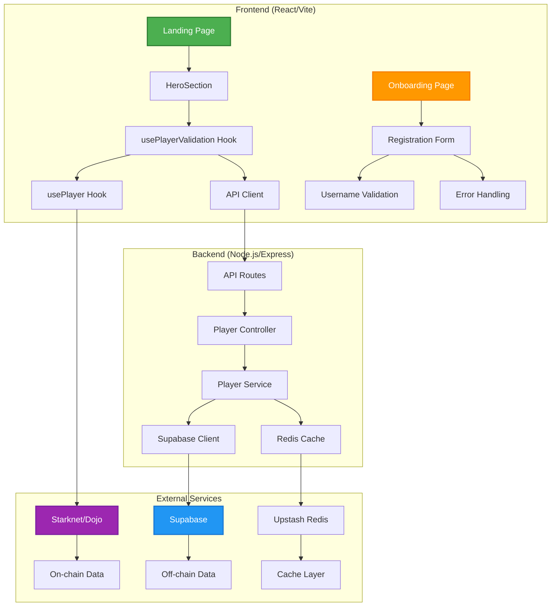
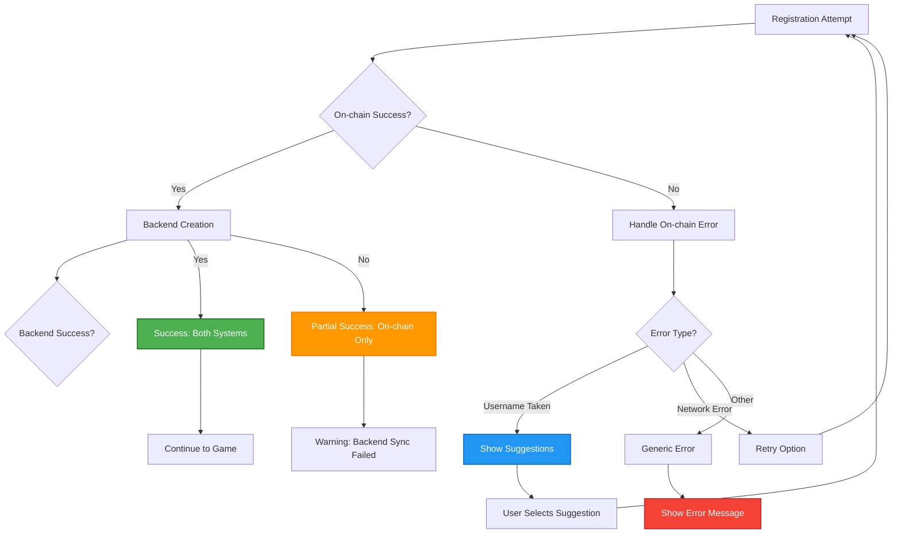
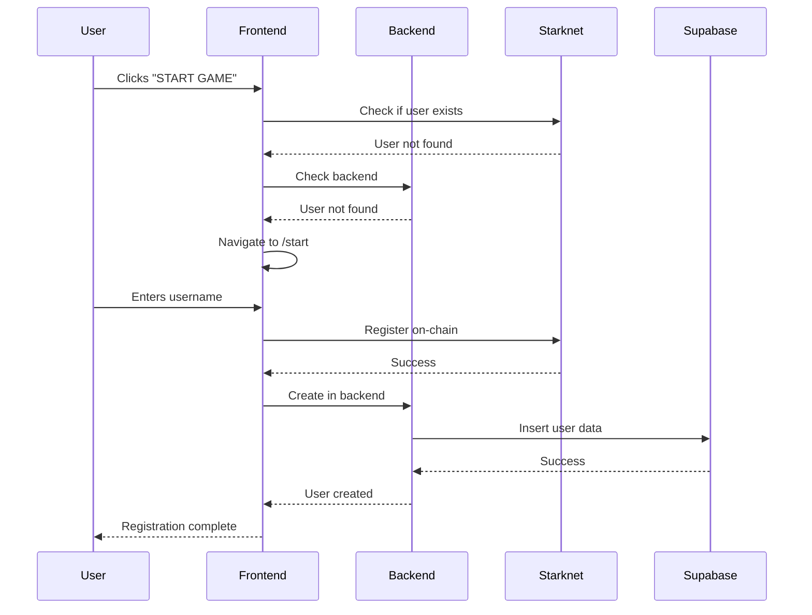
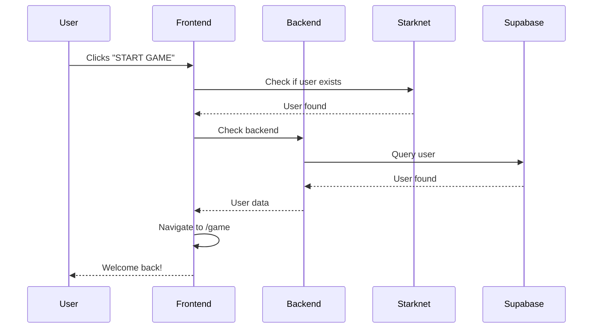

# Player Validation Implementation

This implementation solves the issue described in [#222](https://github.com/AquaStark/Aqua-Stark/issues/222) by adding user validation to the landing page. It checks if a user exists both on-chain and in the backend before determining the appropriate routing.

## Architecture

### System Architecture Diagram



### Components

1. **API Configuration** (`src/config/api.ts`)
   - Centralized API configuration
   - Single point of connection to backend
   - Generic API client for all requests

2. **Environment Configuration** (`src/config/environment.ts`)
   - Environment variables management
   - Feature flags
   - Configuration validation

3. **Player Validation Hook** (`src/hooks/usePlayerValidation.ts`)
   - Combines on-chain and backend validation
   - Handles user synchronization
   - Provides loading states

4. **Updated HeroSection** (`src/components/landing/hero-section.tsx`)
   - Implements validation logic
   - Shows loading states
   - Routes users appropriately

## How It Works

### Flow Diagram

```mermaid
flowchart TD
    A[User clicks "START GAME"] --> B{Wallet Connected?}
    B -->|No| C[Show Error: Connect Wallet]
    B -->|Yes| D[Validate Player Existence]

    D --> E[On-chain Check<br/>usePlayer.getPlayer()]
    D --> F[Backend Check<br/>API: /players/wallet/:address]

    E --> G{Player Exists On-chain?}
    F --> H{Player Exists In Backend?}

    G -->|Yes| I[Player Data Available]
    G -->|No| J[Player Not Found]
    H -->|Yes| K[Backend Data Available]
    H -->|No| L[Backend Data Missing]

    I --> M{Player Exists Anywhere?}
    J --> M
    K --> M
    L --> M

    M -->|Yes| N[Existing User Flow]
    M -->|No| O[New User Flow]

    N --> P[Sync to Backend if Needed]
    P --> Q[Navigate to /game]
    Q --> R[Show Welcome Back Toast]

    O --> S[Navigate to /start]
    S --> T[Onboarding Process]

    T --> U[Register On-chain]
    U --> V[Create in Backend]
    V --> W[User Created in Both Systems]

    style A fill:#4CAF50,stroke:#2E7D32,stroke-width:2px,color:#fff
    style Q fill:#2196F3,stroke:#1976D2,stroke-width:2px,color:#fff
    style S fill:#FF9800,stroke:#F57C00,stroke-width:2px,color:#fff
    style W fill:#9C27B0,stroke:#7B1FA2,stroke-width:2px,color:#fff
    style C fill:#F44336,stroke:#D32F2F,stroke-width:2px,color:#fff
```

### Detailed Flow Steps

```
User clicks "START GAME"
         ↓
   Check if wallet connected
         ↓
   Validate player existence
         ↓
   ┌─────────────────┐
   │ On-chain check  │
   │ (usePlayer)     │
   └─────────────────┘
         ↓
   ┌─────────────────┐
   │ Backend check   │
   │ (API call)      │
   └─────────────────┘
         ↓
   Determine routing:
   ├─ Existing user → /game
   └─ New user → /start
```

### Validation Logic

1. **On-chain Check**: Uses existing `usePlayer` hook to check if player exists on Starknet
2. **Backend Check**: Calls backend API to check if player exists in Supabase
3. **Synchronization**: If player exists on-chain but not in backend, creates backend entry
4. **Routing**:
   - Existing user → `/game`
   - New user → `/start`

## Configuration

### Environment Variables

Create a `.env.local` file in the client directory:

```env
# Backend API URL
VITE_API_URL=http://localhost:3001

# Feature flags (optional)
VITE_BACKEND_INTEGRATION=true
VITE_PLAYER_VALIDATION=true
```

### API Endpoints

The implementation uses these backend endpoints:

- `GET /api/v1/players/wallet/:walletAddress` - Check if player exists
- `POST /api/v1/players` - Create new player

## Usage

### Basic Usage

```typescript
import { usePlayerValidation } from '@/hooks/usePlayerValidation';

function MyComponent() {
  const { validatePlayer, isValidating } = usePlayerValidation();

  const handleStartGame = async () => {
    const validation = await validatePlayer(walletAddress);

    if (validation.exists) {
      navigate('/game');
    } else {
      navigate('/start');
    }
  };
}
```

### Advanced Usage

```typescript
const { validatePlayer, syncPlayerToBackend, createBackendPlayer } =
  usePlayerValidation();

// Validate and sync if needed
const validation = await validatePlayer(walletAddress);

if (validation.isOnChain && !validation.isInBackend) {
  await syncPlayerToBackend(validation.playerData, walletAddress);
}

// Create new backend player
await createBackendPlayer(playerId, walletAddress, username);
```

## Error Handling

The implementation includes comprehensive error handling:

1. **Network Errors**: Fallback to registration flow
2. **Backend Errors**: Continue with on-chain data
3. **Validation Errors**: Default to `/start` route
4. **Loading States**: Disable button during validation

### Error Flow Diagram



## Testing

Run the tests with:

```bash
npm test usePlayerValidation
```

Tests cover:

- Existing user validation
- New user validation
- Backend synchronization
- Error scenarios

## Benefits

1. **Improved UX**: Existing users go directly to game
2. **Efficiency**: Avoids unnecessary registration steps
3. **Consistency**: Uses existing hooks appropriately
4. **Robustness**: Handles errors and loading states
5. **Centralized**: Single API configuration point

## Use Cases & Examples

### Case 1: New User Registration



### Case 2: Existing User Login



## Future Enhancements

1. **Caching**: Cache validation results
2. **Real-time Sync**: WebSocket updates
3. **Offline Support**: Local storage fallback
4. **Analytics**: Track validation metrics
